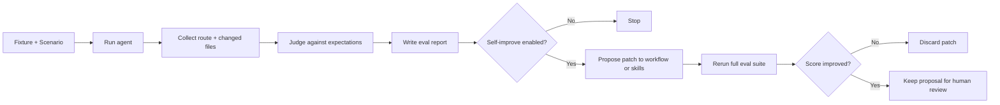

# Gamedev Autoimprovement

Use this document for automated evaluation and later self-improvement of the active `gamedev/` skills.

This is not the manual runbook.
This document is the automation design.

## Goal

Build a repeatable harness that can:

1. run scenario-based evals automatically
2. score routing and artifact quality
3. later support controlled skill and workflow improvements

## Rule Zero

Do not start with self-editing.

Start with:

1. fixed scenarios
2. fixed fixtures
3. fixed judge rules
4. stable reports

Only after that should the agent be allowed to propose changes to skills.

## Phase Plan

### Phase 1. Auto-Evals Only

Build the harness, but do not let it rewrite the skill library.

Expected pieces:

- `fixtures/` with repo starting states
- `evals/scenarios/` with prompts and expected routes
- `scripts/run_evals.py` to execute scenarios
- `scripts/judge_evals.py` to score outputs
- `reports/evals/` for summaries
- scenario files are plain JSON for now so the harness stays stdlib-only
- some fixtures intentionally use a lightweight web runtime because it is cheap to execute, but that must not turn the generic workflow into a browser-only design
- keep core routing expectations platform-agnostic and use browser fixtures only where overlay behavior actually matters

### Phase 2. Batch Regression Runs

Run the eval suite after meaningful workflow or skill changes.

Expected output:

- pass or fail per scenario
- score deltas versus baseline
- failure examples

### Phase 3. Proposal Mode

Allow an agent to suggest changes to:

- `docs/gamedev-workflow.md`
- `gamedev/*/SKILL.md`
- `gamedev/templates/*.md`

But do not auto-merge.

The loop should:

1. propose a patch
2. rerun the eval suite
3. keep the patch only if the score improves

Phase 3 is still proposal-only.
Do not apply the patch automatically.
Do not edit the repo working tree during the proposal cycle.

#### Phase 3 Scaffold

Use an isolated proposal workspace rooted under `reports/evals/proposals/`.

Minimum operator flow:

```bash
python3 scripts/run_evals.py prepare-proposal \
  --baseline-batch reports/evals/runs/<baseline-batch> \
  --focused-scenarios <scenario-a> <scenario-b>

# edit only reports/evals/proposals/<proposal-id>/workspace/

python3 scripts/run_evals.py finalize-proposal \
  reports/evals/proposals/<proposal-id>

python3 scripts/run_evals.py judge-proposal \
  reports/evals/proposals/<proposal-id>
```

What each command does:

- `prepare-proposal` copies only the allowed editable files into an isolated `workspace/` plus a `baseline/` snapshot
- `finalize-proposal` validates the editable scope and writes `candidate.patch`
- `judge-proposal` prepares focused reruns first, waits for those manual runs to be completed, compares them to baseline, and only then prepares the full rerun

Expected proposal artifacts:

- `proposal.json`
- `candidate.patch`
- `decision.json`
- `runs/focused/` and `runs/full/` as disposable rerun workspaces

Acceptance rule:

1. focused rerun must not regress versus baseline
2. only then run the full configured suite
3. keep the proposal only if the full rerun improves score, or ties score with fewer failed checks
4. otherwise keep the artifact only for inspection

### Phase 4. Controlled Self-Improve Loop

Only after the harness is stable:

- run on a separate branch
- restrict editable files
- require full-suite rerun
- require human review before merge

## What To Measure

The judge should score:

- correct first route
- correct prerequisite routing
- correct artifact path
- correct artifact type
- scope discipline
- correct next recommended skill
- correct systems-index status updates when relevant
- correct specialist boundary handling when a scenario intentionally uses a browser overlay

## Suggested Scenario Record

Each auto-eval scenario should define:

- scenario name
- fixture name
- prompt
- expected first skill
- expected artifact paths
- forbidden behaviors

## Example Scenario Fields

```json
{
  "name": "implement_without_gdd",
  "fixture": "scaffold_only",
  "prompt": "реализуй combat",
  "expected_first_route": "design-system",
  "expected_paths": [],
  "forbidden_behaviors": [
    "production code edits for combat",
    "multi-system implementation"
  ]
}
```

## Phase 1 Commands

The current baseline commands are:

```bash
python scripts/run_evals.py list
python scripts/run_evals.py prepare --all
python scripts/judge_evals.py judge-batch reports/evals/runs/<batch-name>
```

## Safety Boundaries

If self-improvement is enabled later, restrict writes to:

- `docs/gamedev-workflow.md`
- `docs/gamedev-specialist-handoffs.md`
- `docs/gamedev-manual-runs.md`
- `docs/gamedev-autoimprovement.md`
- `gamedev/*/SKILL.md`
- `gamedev/templates/*.md`

Do not let the loop freely rewrite:

- unrelated repo docs
- archived material
- user project code outside the skill repo
- proposal rerun artifacts under `reports/evals/proposals/`

## Failure Cases

Do not count a run as successful if:

- the agent picked the wrong first step but eventually recovered
- the agent created the wrong artifact and also the right one
- the agent solved a blocked case by improvising around prerequisites
- the agent completed a step-by-step request by silently running downstream stages

## Baseline Before Automation

Before any self-improvement loop, make sure:

1. manual runs already exist and are understandable
2. at least one baseline score is saved
3. blocked scenarios are included
4. score regressions are easy to inspect

## Minimal Automation Diagram



## Recommended Order

Do this in order:

1. finish manual runbook
2. create fixtures
3. create scenario files
4. implement runner
5. implement judge
6. save baseline results
7. only then experiment with autoimprovement

## Practical Recommendation

Right now the correct next move is not self-improvement.

The correct next move is:

1. define the manual scenario set
2. run it
3. turn those scenarios into machine-readable evals
4. only then add proposal or self-improvement logic

That baseline is now in place.
The correct next move after Phase 2 is a thin Phase 3 scaffold:

1. isolate editable files in proposal workspaces
2. save candidate patches as artifacts
3. gate proposals through focused reruns first
4. require a full rerun before calling a proposal an improvement
5. keep human review as the final merge gate
