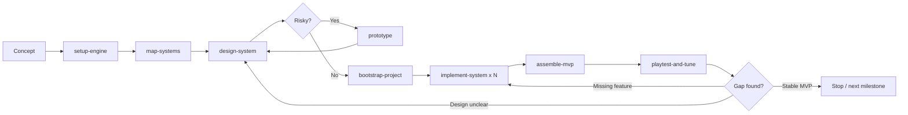
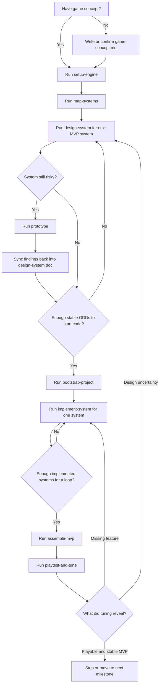

# Gamedev Workflow

This document is the canonical usage guide for the active `gamedev/` skill set.

Related docs:

- manual runbook: `docs/gamedev-manual-runs.md`
- automation design: `docs/gamedev-autoimprovement.md`
- specialist boundaries: `docs/gamedev-specialist-handoffs.md`

Use it to answer two questions:

1. When should the agent run the full gamedev flow automatically?
2. When should the agent stay inside one explicit step?

## Default Modes

There are only two normal usage modes.

## Scope Of This Workflow

`gamedev/` is platform-agnostic.

It owns workflow routing, prerequisite checks, canonical artifacts, evidence closure, and status sync for games across browser, desktop, console, mobile, and engine-native projects.

It does not try to be the deepest runtime specialist for every stack.
When runtime-, UI-, asset-, or QA-specific depth is needed, overlay the appropriate specialist guidance for that platform.
For browser projects, that usually means `Game Studio` when available.

## One-Screen Cheat Sheet

Use this as the short version.

### Fast Rule

- user asks for result like `make a game` -> full-run mode
- user asks for one artifact or one skill like `write a design doc` -> step-by-step mode
- if the requested step is blocked, route to the nearest missing prerequisite

### Short Path

`concept -> setup-engine -> map-systems -> design-system -> prototype if risky -> bootstrap-project -> implement-system x N -> assemble-mvp -> playtest-and-tune`

### Tiny Diagram

### Start Here

| User asks for | Start with |
|---------------|------------|
| `pick the stack` | `setup-engine` |
| `break the game into systems` | `map-systems` |
| `write a design doc` | `design-system` |
| `test a risky mechanic` | `prototype` |
| `bootstrap the project` | `bootstrap-project` |
| `implement a system` | `implement-system` |
| `assemble the first playable` | `assemble-mvp` |
| `do a tuning pass` | `playtest-and-tune` |

### 1. Full-Run Mode

Use full-run mode when the user asks for an end result rather than a specific artifact or skill step.

Typical prompts:

- `make me a game about X`
- `assemble the first playable`
- `take this concept to MVP`

In full-run mode, the agent should choose the next skill based on the current repository state and move forward through the active flow instead of waiting for the user to name every step.

Full-run mode is not complete just because the repo has docs.
Treat the run as complete only when the current repository state supports one real MVP closure point:

- concept, stack choice, systems map, and required MVP system GDDs exist
- a runnable scaffold exists in the main project tree
- core MVP systems exist in production code
- one coherent playable loop exists
- every high-risk system listed in `design/gdd/systems-index.md` is covered either by a relevant `prototypes/[slug]/REPORT.md` or by durable downstream evidence recorded in canonical docs or reports
- `README.md` tells a human how to install, run, build, and test the project
- `reports/mvp-assembly-report.md` exists and describes the actual verified loop
- `reports/playtest-report.md` exists after a real playtest pass, even if no tuning changes were accepted
- best-effort verification commands have been run and recorded, or the environment blocker is stated explicitly

### 2. Step-by-Step Mode

Use step-by-step mode when the user explicitly asks for one artifact, one decision, or one named skill.

Typical prompts:

- `write the combat design doc`
- `pick the stack`
- `bootstrap the scaffold`
- `implement movement`
- `do a playtest pass`

In step-by-step mode, the agent should stay inside that step, produce the requested artifact, and return the next recommended handoff without silently running the whole chain.

## Mode Selection Rules

Use these rules in order:

1. Explicit skill name wins.
   If the user names `setup-engine`, `design-system`, `implement-system`, or another gamedev skill, use that skill.
2. Explicit artifact wins.
   If the user asks for `docs/technical-preferences.md`, `design/gdd/systems-index.md`, a system GDD, or a report, treat that as step-by-step mode even if the user does not know the skill name.
3. End-result requests use full-run mode.
   If the user asks for a game, MVP, vertical slice, or playable build without naming a step, route through the full flow based on what already exists in the repo.
4. Missing prerequisites route backward.
   If the requested step cannot be done cleanly, route to the nearest missing prerequisite skill instead of improvising around the gap.
5. Existing files are the source of truth.
   Prefer continuing from `docs/technical-preferences.md`, `design/gdd/systems-index.md`, system GDDs, prototype reports, and current code instead of re-asking questions already answered in files.
6. Specialist overlays do not replace artifact ownership.
   Browser or engine specialists may guide implementation details, but `gamedev/` still owns the canonical docs, reports, and step-to-step handoff.

## Active Flow

The active gamedev path has two connected lanes.

### Preproduction Lane

1. `setup-engine`
2. `map-systems`
3. `design-system`
4. `prototype` when risk is still real

### Production Bridge

1. `bootstrap-project`
2. `implement-system`
3. `assemble-mvp`
4. `playtest-and-tune`

## Specialist Overlays

This is not a third lane.
It is an overlay on top of the same flow.

- Browser projects may use `Game Studio` or another browser specialist for runtime architecture, scaffold defaults, UI direction, asset pipeline depth, and browser QA.
- Non-browser projects should use engine-native docs or project-local specialists for Godot, Unity, Unreal, custom engines, or proprietary runtimes.
- `gamedev/` still owns `docs/technical-preferences.md`, `design/gdd/`, `prototypes/`, `reports/`, and the status model.

Use `docs/gamedev-specialist-handoffs.md` for the detailed ownership split.

## Full-Run Routing

In full-run mode, choose the next step from repository state.

### No gamedev docs yet

Route:

1. create `design/gdd/game-concept.md` if the concept itself is still missing
2. run `setup-engine`
3. run `map-systems`

### Stack is known, but systems are not mapped

Route:

1. use `docs/technical-preferences.md`
2. run `map-systems`
3. run `design-system` for the highest-leverage MVP system

### Systems are mapped, but GDDs are still thin

Route:

1. run `design-system` one system at a time in dependency order
2. run `prototype` only for systems whose risk blocks confident implementation
3. fold prototype findings back into the canonical GDDs before moving on

### GDDs are ready and implementation can start

Route:

1. run `bootstrap-project` once `docs/technical-preferences.md` is stable
2. if the project needs runtime-specific scaffold or architecture depth, apply the relevant specialist guidance without replacing the `bootstrap-project` artifact contract
3. run `implement-system` for one MVP system at a time
4. update the systems index as systems move to `implemented`

### Multiple systems exist in code

Route:

1. run `assemble-mvp`
2. verify which systems are now truly `integrated`
3. run `playtest-and-tune`

### Tuning reveals a real feature gap

Route:

1. return to `implement-system` if the blocker is missing functionality
2. return to `design-system` or `prototype` if the blocker is actually a design uncertainty

## Full-Run Guardrails

Use these rules to keep full-run mode from stalling or drifting.

### Prototype Ceiling

- Do not open a new `prototype` just because a system is still interesting.
- Use `prototype` only when one concrete unanswered question is actively blocking confident implementation or tuning.
- If an existing prototype already picked a usable default, fold that evidence into the canonical GDD and continue downstream.
- If implementation or playtest evidence contradicts an older prototype, update the canonical docs to the new accepted baseline instead of opening a near-duplicate spike by default.

### Risk Coverage Rule

- If `design/gdd/systems-index.md` has a `High-Risk Systems` section, treat it as a closure ledger, not as brainstorming.
- Each high-risk row must close in one of two ways before full-run mode can stop:
  - a relevant `prototypes/[slug]/REPORT.md` exists and its findings are folded back into the canonical docs, or
  - durable downstream evidence in versioned project paths proves the risk is now covered without a separate prototype
- `Prototype Candidate: None planned` is valid only when `Evidence Needed` names the concrete downstream proof expected to close that row.
- Do not claim a full-run MVP is closed while `High-risk systems without evidence coverage` is still non-zero unless the user explicitly accepts that unresolved risk as a follow-up.

### Doc Sync Rule

- `design/gdd/systems-index.md` is not enough on its own.
- When a system becomes `implemented` or `integrated`, sync the matching system GDD header and acceptance criteria so the canonical docs match reality.
- Do not leave a system GDD in `Draft` or `informed-by-prototype` if the repo already treats that system as part of the integrated playable baseline.

### Durable Evidence Rule

- Accepted evidence must live in stable project paths such as `reports/` or the relevant `prototypes/[slug]/` folder.
- Do not rely on ignored scratch paths, temporary tool logs, or local daemon output as the only evidence referenced by durable reports.
- If a report cites screenshots, captures, or logs as evidence, either save a stable copy under versioned project paths or make the verification command reproducible enough that another operator can regenerate it.

### Verification Rule

- For any platform, prefer ending full-run with at least install, build, run, and one repeatable sanity command or checklist when the stack supports it.
- Prefer repo-native verification owned by the project over ambient external tooling that is not part of the chosen runtime or repository contract.
- For browser projects, browser-open, screenshot, and specialist QA probes are supporting evidence unless the repo explicitly owns that automation path.
- Do not claim a first playable is closed if the build does not run, the loop is not actually reachable, or the reports were written without a real run.

## Step-by-Step Routing

When the user asks for one step, stay inside the scope of that step.

- `setup-engine`: choose the engine and write `docs/technical-preferences.md`; for browser projects, record which browser specialist guidance shaped the runtime choice
- `map-systems`: build or refresh `design/gdd/systems-index.md`
- `design-system`: write one canonical system GDD
- `prototype`: answer one risky question with disposable code and `REPORT.md`
- `bootstrap-project`: create the smallest runnable scaffold; for browser projects, use the relevant specialist runtime conventions instead of inventing a parallel local doctrine
- `implement-system`: implement one approved system in production code
- `assemble-mvp`: wire implemented systems into one coherent playable loop and keep the canonical assembly report here even when specialist QA tools are used
- `playtest-and-tune`: run one focused tuning pass and write the report only after the playable loop actually runs; otherwise route back with no report

End by naming the next recommended skill. Do not silently consume multiple downstream stages unless the user asked for a full run.

## Step-by-Step Full Cycle

Use this when you want the whole path spelled out in the dumbest possible form.

### Straight Path

1. Write or confirm `design/gdd/game-concept.md`.
   If the concept is still fuzzy, do not choose a stack or implement code yet.
2. Run `setup-engine`.
   Output: `docs/technical-preferences.md`.
3. Run `map-systems`.
   Output: `design/gdd/systems-index.md`.
4. Run `design-system` for the first MVP system.
   Usually start with the system that unlocks the most downstream work.
5. If that system is risky or unclear, run `prototype`.
   Then fold findings back into the canonical GDD before moving on.
6. Repeat `design-system` for the next MVP systems until the first implementation set is stable.
7. Run `bootstrap-project`.
   Output: the smallest runnable project scaffold.
8. Run `implement-system` for one approved system.
   Repeat one system at a time.
9. When at least two core systems exist in production code, run `assemble-mvp`.
   Output: one coherent playable loop plus `reports/mvp-assembly-report.md`.
10. Run `playtest-and-tune`.
   Output: one real playtest pass plus `reports/playtest-report.md`, even if the final conclusion is to keep the current baseline unchanged.
11. Update the `High-Risk Systems` section and progress snapshot so every remaining open risk has an explicit closure path.
12. If tuning finds a missing mechanic, return to `implement-system`.
13. If tuning finds a design uncertainty, return to `design-system` or `prototype`.
14. Repeat the loop until the MVP is playable, understandable, verified, and stable enough for the next milestone.

### Simple Decision Diagram

### Shortcut Table

| If user says | Start here | Usually next |
|--------------|------------|--------------|
| `pick the stack` | `setup-engine` | `map-systems` |
| `break the game into systems` | `map-systems` | `design-system` |
| `write the combat design doc` | `design-system combat` | `prototype` or next `design-system` |
| `test the dash mechanic` | `prototype` | update `design-system` |
| `bootstrap the project` | `bootstrap-project` | `implement-system` |
| `implement movement` | `implement-system movement` | next `implement-system` or `assemble-mvp` |
| `assemble the first playable` | `assemble-mvp` | `playtest-and-tune` |
| `tune the combat loop` | `playtest-and-tune combat` | `implement-system`, `assemble-mvp`, or another tuning pass |

## Anti-Patterns

Do not do the following:

- jump from concept straight into `bootstrap-project` when the systems map is still unclear
- let browser fixtures or specialist plugins rewrite the generic flow into a browser-only workflow
- treat `prototype` code as production code
- implement multiple unrelated systems inside one `implement-system` pass
- use `assemble-mvp` as a disguised feature factory
- use `playtest-and-tune` to hide missing mechanics behind value tweaks
- write a `playtest-and-tune` report for a scaffold or blocked run that never became a real playable loop

## Expected Interaction Style

The routing should feel deterministic, not magical.

- If the user asks for an outcome, the agent may choose the next skill.
- If the user asks for a specific step, the agent should stay on that step.
- If the step is blocked, the agent should say which prerequisite is missing and route there explicitly.
- If the repository already contains the needed artifacts, the agent should continue from them rather than restarting the flow.
